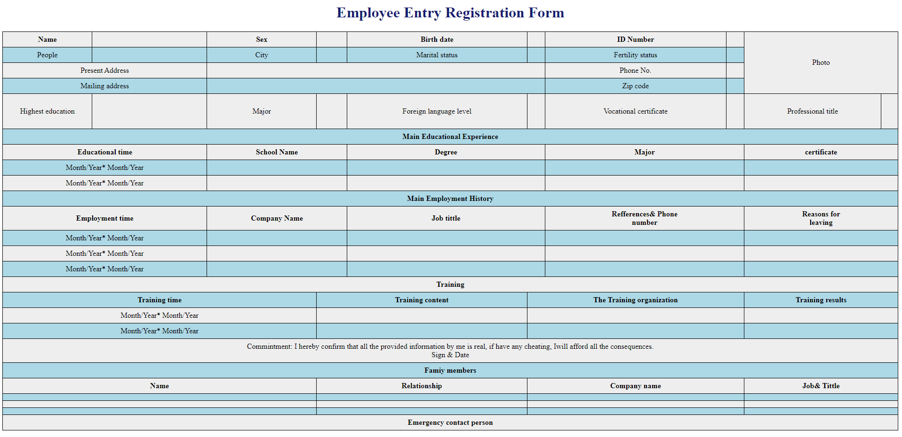

# Employee-register-form
Sample employee register form using HTML and CSS 

  ## Table of Contents

  <ol>
    <li><a href="#Demonstration of the Employee Register Form ">Demonstation</a></li>
    <li><a href="#Contributing">Contributing</a></li>
    <li><a href="#Acknowledgments">Acknowledgments</a></li>
    <li><a href="#Contact">Contact</a></li>
  </ol>

## Demonstration of the Employee Register Form 

## Contributing

Contributions are what make the open source community such an amazing place to learn, inspire, and create. Any contributions are welcome, please feel free to to make it better. Your contribution is **highly appreciated**

If you have a suggestion that would make this better, please fork the repo and create a pull request. 

1. **Fork** the Project
2. Create a new **Branch**
3. **Commit** your Changes 
4. Push to the **Branch** 
5. Open a **Pull Request**

<a href="#top">back to top</a>

## Acknowledgments

* [HTML tables](https://www.geeksforgeeks.org/html-tables/)
* [HTML Table Attributes](https://www.w3schools.com/html/html_table_headers.asp)
* [GitHub Pages](https://pages.github.com)

## Contact
 

